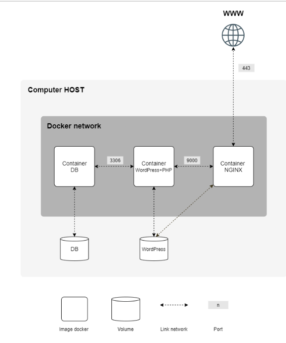

# INCEPTION

_System Administration | Docker related project._

## Project objective

The diagram above is present in the subject, and it illustrates a Docker-based architecture for running a WordPress site. 

Here's a breakdown of the components and how they interact:

__Computer HOST:__ Virtual machine where Docker is running.

__Docker Network:__ Isolated network within Docker that allows the containers to communicate with each other.

- __Containers:__
    - __Container DB:__ Runs the MariaDB database.
        - __Volume: DB__ - This volume stores the database data.
        - __Port: 3306__ - The default port for MySQL/MariaDB used for database connections.
    - __Container WordPress+PHP:__ Runs the WordPress application along with PHP.
        - __Volume: WordPress__ - This volume stores WordPress files.
        - __Port: 9000__ - This port is used for PHP-FPM to communicate with the web server (NGINX).
    - __Container NGINX:__ Runs the NGINX web server.
        - __Port: 443__ - This is the HTTPS port exposed to the outside world (WWW).

- __Connections:__
    - __DB Container:__ Communicates with the WordPress+PHP container on port 3306 for database operations.
    - __WordPress+PHP Container:__ Communicates with the NGINX container on port 9000 for serving PHP content.
    - __NGINX Container:__ Exposes port 443 to the WWW, allowing external access to the WordPress site over HTTPS.

- __WWW:__ Represents the external world accessing your NGINX container over port 443 (HTTPS).

__Explanation of Components:__

__Image Docker:__ Represents the Docker images used to create the containers. 
__Volume:__ Persistent storage used by the containers. 
__Link Network:__ Network connections between the containers. 
__Port:__ The ports used for communication between containers and for external access.

This setup ensures that all traffic to the WordPress site is routed through NGINX, which handles HTTPS connections, and then proxies requests to the appropriate backend service (either the WordPress+PHP container or the MariaDB container).

## Common Dockerfile Commands

__FROM:__ Specifies the base image.  
__ENV:__ Sets environment variables.  
__ARG:__ Defines arguments that can be passed at build time.  
__WORKDIR:__ Sets the working directory for subsequent instructions.  
__COPY:__ Copies files or directories from the host machine to the image.  
__RUN:__ Executes commands inside the container during build time.  
__EXPOSE:__ Informs Docker that the container listens on the specified network ports at runtime. 
__CMD:__ Provides default arguments for the ENTRYPOINT instruction. 
__VOLUME:__ Creates a mount point and/or marks it as holding externally mounted volumes from native host or other containers.  
__HEALTHCHECK:__ Specifies a command to run to check the container's health. 

## Common docker-compose.yml configurations

__Services:__ Defines individual containers and their configurations.
  __Networks:__ Defines custom networks for connecting containers.
  __Volumes:__ Defines named volumes or host paths for persisting data.
  __Environment Variables:__ Defines environment variables for services.
  __Depends On:__ Specifies dependencies between services to control startup order.

## Unordered list of concepts

### Docker

Docker is a platform that enables developers to package, distribute, and run applications within isolated environments called containers. These containers encapsulate all the dependencies and libraries required for an application to run, ensuring consistency and portability across different computing environments. Docker simplifies software development, deployment, and scaling by providing a standardized way to build, ship, and run applications.

### Container

A container in the context of Docker is a lightweight and portable encapsulation of an application and its dependencies, including the code, runtime, system tools, libraries, and settings required to run it. It provides a consistent environment for software to run across different computing environments, such as development, testing, and production. Containers share the host operating system kernel but are isolated from each other, allowing multiple containers to run on the same host without interference. They offer benefits such as portability, scalability, and efficiency, making it easier to package, deploy, and manage applications compared to traditional virtual machines.

### Dockerfiles

Dockerfiles are text files containing a set of instructions used to build Docker images. These instructions specify the steps needed to assemble the image, such as installing dependencies, copying files, setting environment variables, and defining the runtime behavior. Dockerfiles follow a simple syntax and convention, making it easy to automate the process of creating Docker images for various applications.

### Docker Image

A Docker image is a lightweight, standalone, executable package that contains all the necessary components to run an application, including code, runtime, libraries, and system tools. Images are built using a Dockerfile, which specifies the instructions for creating the image layer by layer. Once built, Docker images can be distributed and shared through Docker registries, allowing developers to deploy applications consistently across different environments.

### Docker Hub

Docker Hub is a cloud-based repository provided by Docker that allows users to store, manage, and distribute Docker images. It provides a centralized location for sharing Docker images, making it easier for developers to access and deploy containerized applications.

### Docker Network

Docker network enables communication between Docker containers, allowing them to securely interact with each other. It provides isolation and segmentation of network traffic between containers, ensuring that services running in different containers can communicate with each other as needed.

Here's what each type of network represents:

__bridge:__ This is the default network created by Docker. Containers connected to the bridge network can communicate with each other.

__host:__ This network allows containers to share the host's network namespace, effectively bypassing Docker's network isolation.

__none:__ This network provides no network connectivity. Containers attached to this network cannot communicate with the external network or other containers.

### Docker Secrets

Docker secrets are a secure way to manage sensitive data, such as passwords, API keys, and other credentials, within Docker containers. Secrets are encrypted and only accessible to the services that need them, providing an extra layer of security for containerized applications.

### PID 1 and Dockerfiles

PID 1 refers to the process with ID 1 in a Linux system, which is typically the init process responsible for managing other processes. In Dockerfiles, it's important to properly manage the PID 1 process to ensure correct signal handling and graceful shutdown of Docker containers.

### Daemons (related to Dockers)

Docker daemons are background processes that run on the host machine and manage Docker objects such as containers, images, volumes, and networks. They listen for Docker API requests and handle the execution of Docker commands, allowing users to interact with the Docker engine.

### Benefits of Docker vs VM

Docker provides lightweight and portable containers that encapsulate applications and their dependencies, making them easier to deploy and manage compared to traditional virtual machines (VMs). Docker containers share the host OS kernel, resulting in faster startup times, lower resource overhead, and improved efficiency compared to VMs.

### NGINX 

NGINX is a high-performance, open-source web server and reverse proxy server known for its speed, scalability, and flexibility. It's commonly used to serve static and dynamic content, handle SSL/TLS termination, load balancing, and caching, making it a popular choice for hosting websites and web applications.

### TLSv1.2 | TLSv1.3

TLS (Transport Layer Security) is a cryptographic protocol used to secure communication over a computer network. TLSv1.2 and TLSv1.3 are versions of the TLS protocol, with TLSv1.3 being the latest and most secure version. NGINX supports both TLSv1.2 and TLSv1.3, allowing encrypted connections for improved security.

### WordPress

WordPress is a popular open-source content management system (CMS) used for creating websites, blogs, and online stores. It's written in PHP and often paired with a MySQL or MariaDB database for storing content and configuration settings.

### PHP-FPM 

PHP-FPM (FastCGI Process Manager) is a PHP FastCGI (Common Gateway Interface) daemon that provides a high-performance alternative to traditional CGI-based PHP processing. It manages PHP processes and serves PHP files to web servers like NGINX, improving the performance and scalability of PHP-based web applications.

### WordPress Database

The WordPress database stores all the website's content, settings, and user data. It uses a relational database management system (RDBMS) such as MySQL or MariaDB to organize and retrieve data efficiently. The database is essential for storing posts, pages, comments, user accounts, and other dynamic content.

### WordPress Website Files

WordPress website files include PHP scripts, themes, plugins, media uploads, and other files necessary to run a WordPress site. These files are stored in the web server's document root directory and are responsible for generating and serving web pages to visitors.

### MariaDB

MariaDB is an open-source relational database management system (RDBMS) that is derived from MySQL and designed as a drop-in replacement for it. It offers high performance, scalability, and reliability for storing and retrieving data in a structured format. MariaDB supports various storage engines, transactions, replication, clustering, and other advanced database features. It is widely used in web development, e-commerce, content management systems, and other applications where structured data storage and retrieval are required. MariaDB is known for its ease of use, compatibility with MySQL, and active community support, making it a popular choice for database management in both small-scale and large-scale deployments.

### docker-compose.yml

A Docker Compose file is a YAML file that defines how Docker containers should behave when they're run together as part of an application. It allows you to define multiple services, such as databases, web servers, and other components, and specify how they should be configured, how they should communicate with each other, and how they should be orchestrated.

In a Docker Compose file, you can specify things like:

__Services:__ Each service represents a containerized application or component of your application.

__Image:__ The Docker image to use for each service, which defines what software is installed in the container.

__Ports:__ The ports on the host machine that should be mapped to ports on the container.

__Volumes:__ Directories or files on the host machine that should be mounted into the container.

__Environment variables:__ Environment variables that should be passed to the container.

__Dependencies:__ Dependencies between services, specifying which services should start before others.

__Networking:__ How services should communicate with each other.

Docker Compose, is used to start and manage multi-container Docker applications with a single command, making it easier to develop, test, and deploy complex applications.

## Interacting with MariaDB

You can get inside a running Docker container that is running in interactive mode. In order to do that, run the following command:

`docker exec -it mariadb bash`

In order to then interact with the database, you first need to login to the MariaDB server:

`mariadb -u root -p`

Some common commands, once interacting with the server, are:

Show databases: `SHOW DATABASES;`
  Use specific database: `USE new_database;`
  Show tables inside database: `SHOW TABLES;`
  View all info from speficic field: `SELECT * FROM wp_users;`
  Insert new user to that specific table: `INSERT INTO wp_users (user_login, user_pass, user_email)` ; `VALUES ('new_user', MD5('password'), 'newuser@example.com');`

--------
LinkedIn: https://www.linkedin.com/in/pedrosmpm
